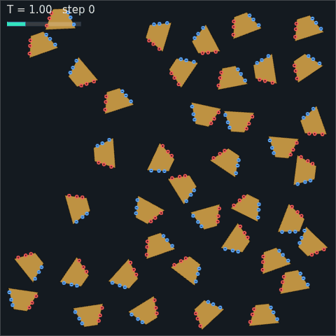
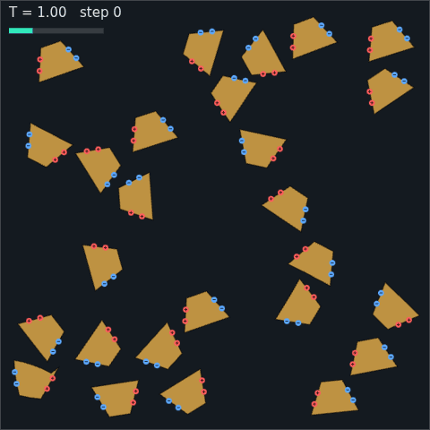
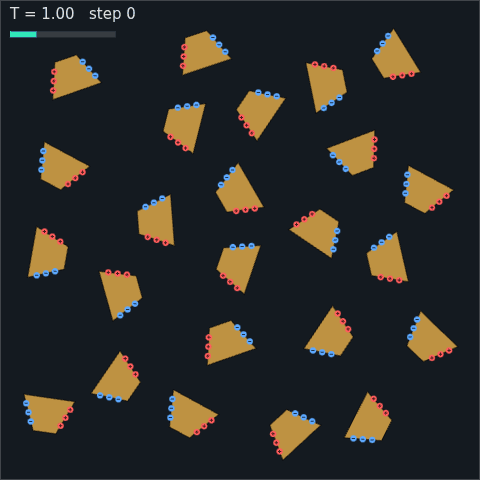
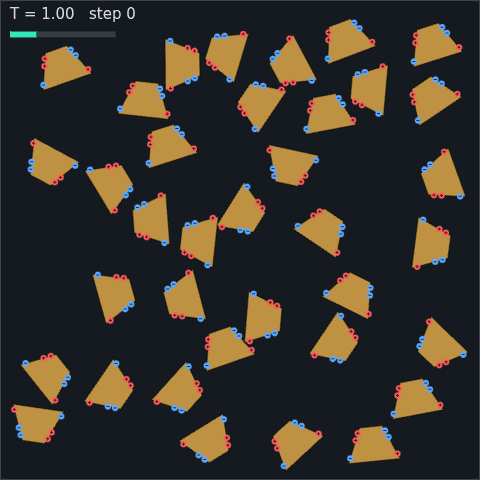
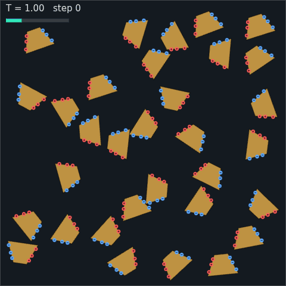

# assemble

**▶ Live: https://ericrosenbaum.github.io/assemble/**

A 2D molecular self-assembly simulator that runs entirely in the browser.
Design molecules as polygons with electrostatic charges on their edges, drop
many copies into a thermal heat bath, and watch ordered structures — rings,
chains, lattices — assemble themselves out of random motion and stickiness.

A modern successor to the Molecular Workbench self-assembly activity
(["Molecular Self-Assembly"](https://concord.org), @Concord, Fall 2005): the
classic demo where wedge-shaped monomers with `+` and `−` charges on their
sloped sides spontaneously form rings, like a cross-section of a microtubule
assembling from tubulin.



*40 wedge monomers annealing into two closed 8-rings (rigid-body engine).*

## Running it

```bash
npm install
npm run dev        # local dev server
npm run build      # static site in dist/ — deployable to GitHub Pages
```

Everything is client-side; there is no server component.

## Two dynamics engines

Both engines implement the same interface (`src/sim/engine.js`) and share
the same screened-Coulomb electrostatics and Langevin heat bath, so you can
switch between them live in the UI:

- **Rigid-body** (`src/sim/rigid/rapier.js`) — molecules are rigid convex
  polygons simulated by [Rapier2D](https://rapier.rs) (Rust → WASM + SIMD).
  Rapier handles contacts and integration; we add charge-site forces as
  impulses and thermal noise per fluctuation–dissipation. Fast and crisp —
  the workhorse.
- **Soft-body** (`src/sim/soft/`) — the original Molecular Workbench style:
  each molecule is particles along its perimeter plus a hub at the centroid,
  joined by stiff springs (a wheel graph, which is rigid in 2D but stays
  slightly squishy). Between molecules: WCA contact repulsion and screened
  Coulomb on charged particles. Opposite-charge "sticky sites" are exempt
  from contact repulsion so they can bind at close range, like patchy
  colloids.



*The same wedge experiment on the soft-body engine: joints zip up one
sticky-site pair at a time and the finished ring is charmingly organic,
where the rigid engine's rings are crisp octagons.*

## Hardware acceleration

The soft engine's per-particle forces are embarrassingly parallel, so it has
three interchangeable compute backends (`auto` picks the best available):

| backend | where it runs | status |
| --- | --- | --- |
| CPU (typed arrays + spatial hash) | everywhere | reference implementation |
| WebGL2 GPGPU (`soft/webgl2.js`) | any GPU incl. iOS Safari | tested: matches CPU to 3e-5 over 40 steps (`test/parity.test.mjs`) |
| WebGPU compute (`soft/webgpu.js`) | modern browsers (iOS 26+, Chrome, Edge) | experimental: line-for-line WGSL port of the WebGL2 kernel; feature-detected with fallback |

The WebGL2 backend packs particle state into RGBA32F textures and evaluates
springs + all-pairs WCA/Coulomb + Langevin integration in a fragment shader
with ping-pong FBOs (MRT writes position and velocity together). Positions
are read back at most once per rendered frame. The WebGPU backend is the
same kernel as WGSL compute over storage buffers, with async readback.

The rigid engine's acceleration comes from Rapier's WASM+SIMD build — its
few hundred charge sites are cheaper on the CPU than a GPU round-trip.

Honest benchmark note: in the headless CI container, WebGL2 runs on
SwiftShader (software rasterizer) and is *slower* than the CPU backend —
GPU backends only pay off on real GPUs. Run `window.__assemble.bench()` in
the console to measure your machine.

## Performance

The simulation runs in a **Web Worker**, so its rate is decoupled from the
frame rate — the worker steps in time-budgeted slices and posts back only the
geometry the renderer needs, in ping-ponged transferable buffers. Before this,
stepping was driven from `requestAnimationFrame` and capped at
`stepsPerFrame × 60 fps` = **1200 steps/s** regardless of engine speed. There
is a **max speed** toggle and a live steps/s readout in the panel.

Profiling (`node tools/bench.mjs`) showed Rapier's actual physics was only
**2–7%** of rigid-engine step time. The real costs were elsewhere:

- **WASM boundary crossings** — one `applyImpulseAtPoint` per charge site was
  47% of step time at 32 molecules. Now the per-site forces and the Langevin
  kick are summed in JS and applied as **one impulse + one torque per body**
  (equivalent by r × F about the cached centre of mass), ~8 crossings per body
  down to 2. Mass, inertia, local centre of mass and per-step pose are cached;
  damping is written only when it changes.
- **The O(M²) charge loop** — 83% of step time at 300 molecules. Whole
  molecule pairs are now rejected on centre distance before any site is
  touched, and the force kernel is inlined so there is no per-pair array
  allocation. The bound uses each spec's site spread about its site-centroid,
  a rigid-body invariant, which makes the culling **provably exact** rather
  than an approximation.
- **Soft-engine allocation** — force evaluation was 99.9% of its step time,
  and it built a `Map` plus one array per occupied cell on every evaluation
  (six times per step). Replaced by `src/sim/cellgrid.js`, a counting sort
  into preallocated typed arrays, with separate grids for the short-range WCA
  cutoff and the longer Coulomb cutoff — so the Coulomb pass is no longer
  O(C²) over all charged particles.

Measured with `npm run bench` (Node 22, 4-core container):

| engine | molecules | before | after | |
| --- | --- | --- | --- | --- |
| rigid | 32  | 1,791 steps/s | 5,723 steps/s | 3.2× |
| rigid | 100 | 543 steps/s   | 2,073 steps/s | 3.8× |
| rigid | 300 | 92 steps/s    | 653 steps/s   | 7.1× |
| soft  | 16  | 1,397 steps/s | 1,895 steps/s | 1.4× |
| soft  | 32  | 525 steps/s   | 832 steps/s   | 1.6× |
| soft  | 64  | 183 steps/s   | 397 steps/s   | 2.2× |

In the app the gain is larger still, because the old ceiling was the render
loop rather than the engine: **1,200 → ~4,700 steps/s** at 32 molecules.

On top of that, the rigid engine's default timestep is now **1/60 rather than
1/120**, so half as many steps cover the same simulated time. That is an
approximation, so it was checked rather than assumed: `tools/sweep.mjs` across
3 seeds — rescaling the annealing schedule with `dt` so the comparison isn't
secretly also a schedule change — showed 1/60 reaching assembly in about half
the wall-clock with ring yield no worse (3/3 seeds vs 2/3), and a dense/hot
stress test (90 molecules in a 64-unit box) gave the same minimum centre
separation and peak speeds as 1/120, so contacts aren't being tunnelled
through. The soft engine deliberately keeps 1/120: its substep is `dt/substeps`
against very stiff springs, and doubling it would spend stability margin the
sweep never tested.

Combined, for the same simulated evolution: **~4× less wall-clock** (2.2× from
the engine work, 1.9× from `dt`). Concretely, the tuned 40-wedge scenario now
reaches two stable closed rings in **11 s**, where the original run took
132 s to finish and found its rings around the two-thirds mark.


*Two closed rings in 11 seconds of wall-clock — the same experiment that
opened this README, after the optimisation pass.*

`test/forces.test.mjs` pins the two risky optimisations: the culled kernel is
checked against the all-pairs reference across sparse/typical/dense packings,
and the soft cell grid against brute force, both to ~1e-16 relative error.
Newton's third law is checked too, since a dropped interaction would break it.

The WebGL2 backend reads results back through a pixel-pack buffer guarded by a
fence rather than a blocking `readPixels`, so the CPU never stalls the GPU
pipeline; rendering may lag the sim by a frame, which is invisible
interactively and irrelevant to correctness.

### Is it still the same physics?

The force kernels are provably identical, but summation order changes, and in
a chaotic system a 1e-16 difference diverges. So equivalence is checked
statistically, not per-trajectory: the tuned wedge scenario was run across 5
seeds on the old and new engines. Rings formed under both, with overlapping
outcome distributions (old 2/5 seeds ending with a closed ring, new 5/5 —
a difference that is *not* significant at this sample size, and there is no
hint of a regression). Reproduce with `tools/sweep.mjs`.

## The wedge-ring experiment

`wedge(nRing)` builds a trapezoid whose sloped sides each tilt by `π/nRing`,
so `nRing` copies mate flush and close into a ring (verified to machine
precision by `test/geometry.test.mjs`). Getting from "wedges attract" to
"wedges reliably form rings" took a series of instructive failures:

| | |
| --- | --- |
|  | **Zigzag chains.** With symmetric charge rows (the 2005 layout) and strong binding, a 180°-flipped wedge that *slides* along the face can pair off charges almost as well as a correct one, and at 300× kT nothing ever un-binds. S-shaped chains freeze in. |
|  | **Lateral tangles.** Long screening lengths make charges reach past their own face — chains glue to each other side-by-side into a 23-molecule clump. |
|  | **First closed ring.** Equal charges at Golomb-ruler positions (all pairwise spacings distinct), short screening, and a long anneal in the selective temperature window. |

What ended up mattering, in order:

1. **Flip symmetry.** A wedge rotated 180° presents its *like-signed* face
   to a growing chain, so equal same-sign charges per face make flipped
   (zigzag) joints purely repulsive. (Adding an opposite-sign "cap" charge —
   tried along the way — accidentally re-enabled zigzags by giving flipped
   faces anchor points at both ends.)
2. **Slide registration.** A face that slides along its partner can still
   align some charge pairs. Placing charges at Golomb-ruler positions
   (`t = 0.2, 0.45, 0.8` — every pairwise spacing distinct) guarantees any
   misregistration aligns at most *one* pair (~12 energy units) while flush
   mating aligns all three (~42).
3. **The selective temperature window.** Anneal by holding where single-pair
   mistakes break (≈7 kT) but full-face bonds hold (≈25 kT) — `kT ≈ 1.7`
   with the tuned constants — then cool slowly, and stop the quench warm
   (`kT ≈ 0.7`) so leftover fragments don't glom onto finished rings.
4. **Low contact friction**, so docking faces can slide into registration.

The tuned constants live in `src/presets.js`.

## A whole family from one rule

The wedge was hand-designed to close a ring of a chosen size. Regular polygons
turn out to need no design at all — one choice determines everything they can
build.

Give a regular *n*-gon a `+` face and a `−` face *k* edges apart. Mating two
faces fixes the partners' relative orientation, so **every** bond rotates the
next molecule by the same angle, `rot = π − 2πk/n`. A ring of *m* closes only
if `m·rot` is a whole number of turns:

> **m = 2n / (n − 2k)**

That single expression predicts the lot, and `test/geometry.test.mjs` checks
it by chaining bonds one at a time — each step only asserting that two faces
sit flush — and then asking whether molecule *m* lands back on molecule 0. It
does, to ~1e-15, for every case below.

| preset | shape | k | predicts | built it? |
| --- | --- | --- | --- | --- |
| `square-2x2` | square | 1 | 4-ring (2×2 pinwheel) | yes |
| `hex-trimer` | hexagon | 1 | 3-ring | yes |
| `hex-ring6` | hexagon | 2 | 6-ring | yes |
| `hex-fiber` | hexagon | 3 | straight chain (`rot = 0`) | yes |
| `tri-rosette` | triangle | 1 | 6-ring rosette | yes |
| `pent-ring10` | pentagon | 2 | 10-ring | yes |
| `square-sheet` | square | — | lattice (all faces charged) | yes |
| `hex-sheet` | hexagon | — | honeycomb sheet | yes |

Two corollaries fall out for free. `k = n/2` puts the faces opposite each
other, giving `rot = 0` — partners stay aligned and the chain runs straight
forever, which is why `hex-fiber` makes filaments rather than rings. And when
`2n/(n−2k)` isn't an integer no ring can close at all: a pentagon with
adjacent charged faces (`m = 10/3`) is geometrically frustrated and only makes
open aggregates.

The `*-sheet` presets charge every face instead of two. Opposite faces must
carry opposite signs, since edge *i* meets edge *i+n/2* in an aligned tiling —
so the first half of the edges get `+` and the rest `−`.

All of these run the **same** charge parameters as the wedge. The structures
differ because of geometry, not tuning; what does change per preset is density
and how long the anneal holds, since a 10-ring needs ten correct encounters in
a row and sheets need crowding before they can tile at all.

## Designing your own molecules

The **molecule designer** panel in the UI lets you drag polygon corners, add
corners, and tap edges to place `+`/`−` charge sites, then run copies of
your design in the bath. Shapes serialize to/from JSON. (The rigid engine
takes the convex hull of concave shapes; the soft engine handles them
as-is.)

## Headless capture & experiments

The same build runs headless for parameter sweeps and movie-making:

```bash
npm run build
node tools/capture.mjs --scenario wedge-8 --engine rigid \
  --steps 120000 --every 450 --out out/run1 --stopRings 2 \
  --overrides '{"count":40,"boxW":76,"boxH":76,"schedule":{"Tstart":1.7,"Tend":0.7,"holdSteps":60000,"coolSteps":30000}}'
python3 tools/frames_to_gif.py out/run1 out/run1.gif --fps 16
```

Step counts here assume the default `dt` of 1/60; schedules are expressed in
steps, so halving `dt` means doubling every step count to cover the same
simulated time.

`--stopRings N` ends the run once N closed rings persist. Ring detection is
a bond-graph cycle check (`src/sim/analysis.js`), also shown live in the UI.

## Tests

```bash
npm test                     # geometry + force-kernel correctness (node, no browser)
node test/parity.test.mjs    # CPU vs WebGL2 physics parity (headless Chromium)
npm run bench                # engine throughput at several molecule counts
node tools/sweep.mjs         # parameter sweep scored on time-to-assembly
```

`tools/sweep.mjs` deliberately scores on **time to assembly** rather than
steps/s: a larger `dt` makes each step cheaper in wall-clock but covers more
simulated time, so throughput alone can favour a setting that never actually
forms rings. It rescales the annealing schedule with `dt` so the comparison
isn't secretly also a schedule change, and flags configurations whose
integrator diverges.
