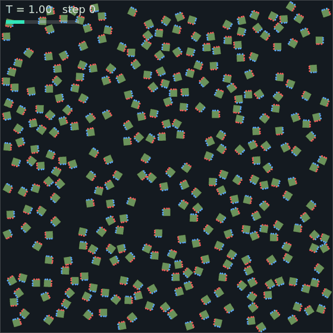
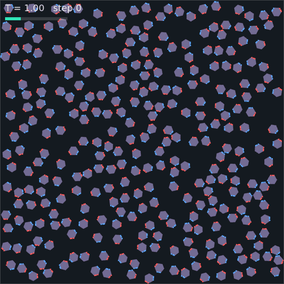
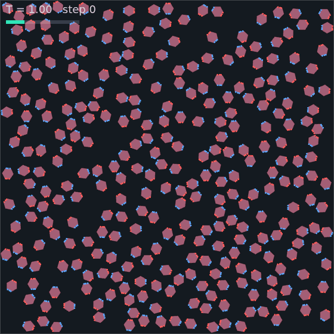
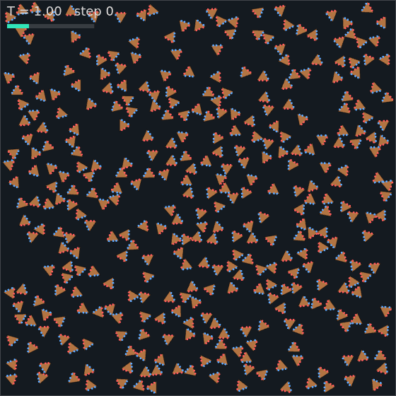
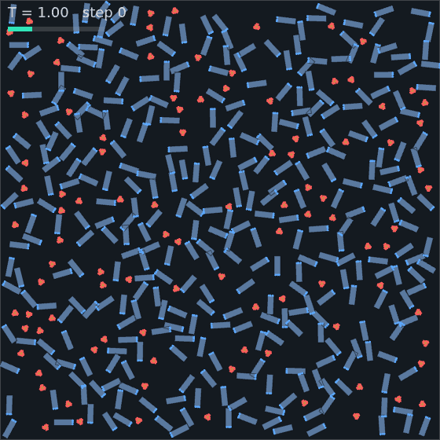
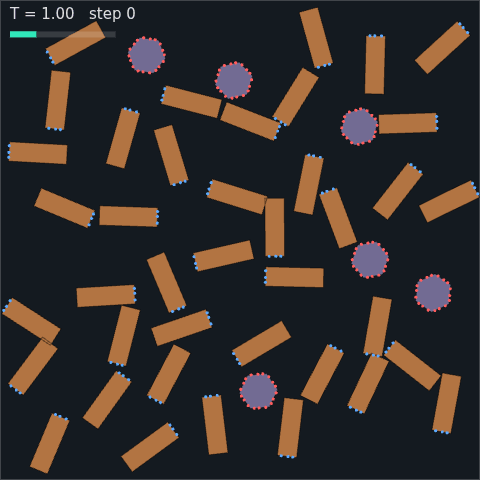
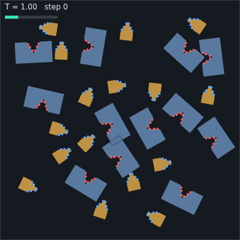
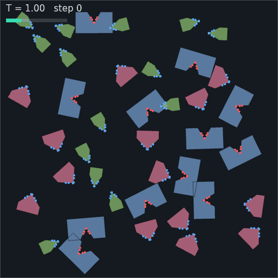
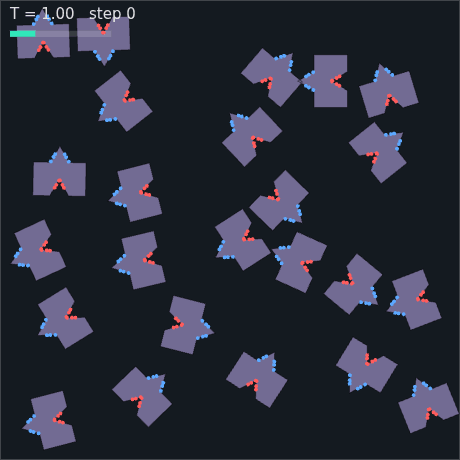
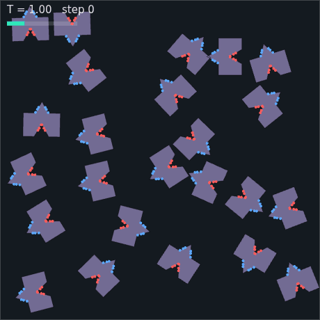

# assemble

**▶ Live: https://ericrosenbaum.github.io/assemble/**

A 2D molecular self-assembly simulator that runs entirely in the browser.
Design molecules as polygons with electrostatic charges on their edges, drop
many copies into a thermal heat bath, and watch ordered structures — rings,
chains, lattices — assemble themselves out of random motion and stickiness.

A modern successor to the Molecular Workbench self-assembly activity
(["Molecular Self-Assembly"](https://concord.org), @Concord, Fall 2005): the
classic demo where wedge-shaped monomers with `+` and `−` charges on their
sloped sides spontaneously form rings, like a cross-section of a microtubule
assembling from tubulin.


*320 wedge monomers annealing into ten closed rings (rigid-body engine),
318 of them bonded into some structure by the end.*

## Running it

```bash
npm install
npm run dev        # local dev server
npm run build      # static site in dist/ — deployable to GitHub Pages
```

Everything is client-side; there is no server component.

## Two dynamics engines

Both engines implement the same interface (`src/sim/engine.js`) and share
the same screened-Coulomb electrostatics and Langevin heat bath, so you can
switch between them live in the UI:

- **Rigid-body** (`src/sim/rigid/rapier.js`) — molecules are rigid convex
  polygons simulated by [Rapier2D](https://rapier.rs) (Rust → WASM + SIMD).
  Rapier handles contacts and integration; we add charge-site forces as
  impulses and thermal noise per fluctuation–dissipation. Fast and crisp —
  the workhorse.
- **Soft-body** (`src/sim/soft/`) — the original Molecular Workbench style:
  each molecule is particles along its perimeter plus a hub at the centroid,
  joined by stiff springs (a wheel graph, which is rigid in 2D but stays
  slightly squishy). Between molecules: WCA contact repulsion and screened
  Coulomb on charged particles. Opposite-charge "sticky sites" are exempt
  from contact repulsion so they can bind at close range, like patchy
  colloids.


*The same wedge experiment on the soft-body engine: joints zip up one
sticky-site pair at a time and the finished ring is charmingly organic,
where the rigid engine's rings are crisp octagons.*

## Hardware acceleration

The soft engine's per-particle forces are embarrassingly parallel, so it has
three interchangeable compute backends (`auto` picks the best available):

| backend | where it runs | status |
| --- | --- | --- |
| CPU (typed arrays + spatial hash) | everywhere | reference implementation |
| WebGL2 GPGPU (`soft/webgl2.js`) | any GPU incl. iOS Safari | tested: matches CPU to 3e-5 over 40 steps (`test/parity.test.mjs`) |
| WebGPU compute (`soft/webgpu.js`) | modern browsers (iOS 26+, Chrome, Edge) | experimental: line-for-line WGSL port of the WebGL2 kernel; feature-detected with fallback |

The WebGL2 backend packs particle state into RGBA32F textures and evaluates
springs + all-pairs WCA/Coulomb + Langevin integration in a fragment shader
with ping-pong FBOs (MRT writes position and velocity together). Positions
are read back at most once per rendered frame. The WebGPU backend is the
same kernel as WGSL compute over storage buffers, with async readback.

The rigid engine's acceleration comes from Rapier's WASM+SIMD build — its
few hundred charge sites are cheaper on the CPU than a GPU round-trip.

Honest benchmark note: in the headless CI container, WebGL2 runs on
SwiftShader (software rasterizer) and is *slower* than the CPU backend —
GPU backends only pay off on real GPUs. Run `window.__assemble.bench()` in
the console to measure your machine.

## Performance

The simulation runs in a **Web Worker**, so its rate is decoupled from the
frame rate — the worker steps in time-budgeted slices and posts back only the
geometry the renderer needs, in ping-ponged transferable buffers. Before this,
stepping was driven from `requestAnimationFrame` and capped at
`stepsPerFrame × 60 fps` = **1200 steps/s** regardless of engine speed. There
is a **max speed** toggle and a live steps/s readout in the panel.

Profiling (`node tools/bench.mjs`) showed Rapier's actual physics was only
**2–7%** of rigid-engine step time. The real costs were elsewhere:

- **WASM boundary crossings** — one `applyImpulseAtPoint` per charge site was
  47% of step time at 32 molecules. Now the per-site forces and the Langevin
  kick are summed in JS and applied as **one impulse + one torque per body**
  (equivalent by r × F about the cached centre of mass), ~8 crossings per body
  down to 2. Mass, inertia, local centre of mass and per-step pose are cached;
  damping is written only when it changes.
- **The O(M²) charge loop** — 83% of step time at 300 molecules. Whole
  molecule pairs are now rejected on centre distance before any site is
  touched, and the force kernel is inlined so there is no per-pair array
  allocation. The bound uses each spec's site spread about its site-centroid,
  a rigid-body invariant, which makes the culling **provably exact** rather
  than an approximation.
- **Soft-engine allocation** — force evaluation was 99.9% of its step time,
  and it built a `Map` plus one array per occupied cell on every evaluation
  (six times per step). Replaced by `src/sim/cellgrid.js`, a counting sort
  into preallocated typed arrays, with separate grids for the short-range WCA
  cutoff and the longer Coulomb cutoff — so the Coulomb pass is no longer
  O(C²) over all charged particles.

Measured with `npm run bench` (Node 22, 4-core container):

| engine | molecules | before | after | |
| --- | --- | --- | --- | --- |
| rigid | 32  | 1,791 steps/s | 5,723 steps/s | 3.2× |
| rigid | 100 | 543 steps/s   | 2,073 steps/s | 3.8× |
| rigid | 300 | 92 steps/s    | 653 steps/s   | 7.1× |
| soft  | 16  | 1,397 steps/s | 1,895 steps/s | 1.4× |
| soft  | 32  | 525 steps/s   | 832 steps/s   | 1.6× |
| soft  | 64  | 183 steps/s   | 397 steps/s   | 2.2× |

(Those are the gains from the optimisation pass. The bigger structural change —
removing the quadratic terms so the whole thing scales linearly — is next.)

### Scaling to tens of thousands of molecules

The optimisations above cut the *constant*, but three things were still
quadratic in the number of molecules, and quadratic wins every argument
eventually. Measured at constant density, cost per doubling was climbing
towards 4× — 2,400 molecules ran at 29 steps/s, and 30,000 extrapolated to
about **0.2 steps/s**, a week per anneal.

All three had the same shape — "check everything against everything" — and the
same fix: bucket by position and check only the neighbourhood.

- **The charge kernel.** Molecule-pair culling rejected distant pairs cheaply
  but still *visited* all M²/2 of them. Centroids are now bucketed at the
  interaction reach, so the visit count is proportional to genuinely nearby
  pairs. Exactness is unchanged and still pinned by `test/forces.test.mjs`
  against the all-pairs reference.
- **Bond detection.** `bondGraph` compared every charge site to every other —
  and it runs on a timer for the live HUD. At 10,000 molecules that is 60,000
  sites and 1.8 billion comparisons per call. Now spatially hashed at the bond
  radius: **106 ms**. `test/analysis.test.mjs` checks it finds exactly the
  bonds a brute-force scan finds, on assembled and unassembled states.
- **Initial placement.** Rejection sampling tested each candidate against every
  molecule already placed. Now hashed at the rejection radius. The RNG is drawn
  in the same order, so placements are bit-identical and every tuned preset is
  untouched.

Snapshots were also allocating one array per molecule plus one per vertex,
every frame; engines now fill a preallocated buffer directly.

The result is linear scaling — cost doubles when the molecule count doubles:

| molecules | before | after |
| --- | --- | --- |
| 300 | 398 steps/s | 518 steps/s |
| 600 | 212 steps/s | 293 steps/s |
| 1,200 | 87 steps/s | 147 steps/s |
| 2,400 | 29 steps/s | 70 steps/s |
| 4,800 | ~7 steps/s (extrapolated) | 33 steps/s |

Throughput is a flat ~165,000 molecule-steps/s at every size, which makes
extrapolation trustworthy for the first time. A 10,000-molecule run — 60,000
charge sites — builds in 0.4 s, runs at 11 steps/s, stays thermally stable
(peak 0.88× equilibrium), and had 9,002 molecules bonded into 15 closed rings
after 4,000 steps.

Where the remaining time goes, profiled at 2,400 molecules:

| phase | ms/step | |
| --- | --- | --- |
| charge kernel | 6.72 | 51% |
| pose readback from WASM | 2.49 | 19% |
| impulses + bookkeeping | 2.54 | 19% |
| Rapier contact solve | 1.37 | 10% |

Worth noting because it is counterintuitive: **the physics engine is not the
bottleneck**. Rapier is a tenth of the step. Anything faster has to attack our
own force kernel — parallelising it across workers, or moving the rigid engine
onto the GPU the way the soft engine already is.

### Spending it: the presets are now ten times bigger

Defaults were sized for the old engine — 32 molecules in a 64-unit box. Every
preset now runs **10× the molecules**, with the *packing fraction held fixed*
so the box grows with it (√10 ≈ 3.2× per side) and the physics is untouched.
Density matters as much as the charge constants, so scaling count without
scaling the box would have silently retuned every scenario. The four presets
that hard-coded a box now declare their measured packing instead, so they
scale with the rest.

What that buys, at identical parameters and the same 130k-step schedule:

| preset | was | now |
| --- | --- | --- |
| `wedge-8` | 32 molecules, 1 closed ring | **320**, 10 closed rings, 318 bonded |
| `square-2x2` | 32 molecules, 6 blocks | **320**, 46 blocks, 317 bonded |
| `hex-ring6` | 30 molecules, 2 rings | **300**, 9 rings, 291 bonded |

The schedules did *not* need rescaling, which is worth stating because it was a
real question: annealing schedules are written in steps and were tuned at 32
molecules. Assembly kinetics are local — a bigger box at the same density gives
each molecule a statistically identical neighbourhood — so the same schedule
produces proportionally more structures in the same number of steps. Measured,
not assumed.

Rendering used to be the binding limit — Canvas2D cost 2–4 ms/frame at these
counts and 69 ms at 3,000, which is where the defaults were originally sized
to. The instanced renderer below removed that ceiling, so what now bounds the
default is legibility: a fixed canvas with a √N box means molecules shrink as
the count grows, and past a few thousand they are specks.

### Instanced WebGL2 rendering

Canvas2D rebuilt a path from every vertex of every molecule on every frame, so
its cost scaled with total vertices and it — not the physics — capped the
interactive molecule count. But a rigid molecule's geometry never changes in
its own frame. It belongs on the GPU once, with only the pose travelling per
frame.

`src/render/gl.js` uploads each species' triangulated fill and outline loop as
static buffers and draws all its molecules in **one instanced call**, with a
per-instance `[x, y, cos, sin]`. Charge sites are a second instanced pass — one
unit quad, shaded into a disc in the fragment shader. Draw calls per frame go
from a path operation per vertex to two per species plus one, independent of
molecule count. The worker now posts poses rather than outline vertices, which
is three floats per molecule instead of two per vertex and shrinks the
per-frame transfer about fivefold.

Measured on identical scenes, drawing only (`?render=gl` vs `?render=2d`):

| molecules | Canvas2D | instanced WebGL2 | |
| --- | --- | --- | --- |
| 320 | 2.29 ms/frame | **0.21 ms** | 11× |
| 1,500 | 15.98 ms/frame | **0.39 ms** | 41× |
| 3,000 | 62.22 ms/frame | **1.06 ms** | 59× |

Those are on SwiftShader — a *software* rasteriser — so a real GPU has more
headroom still. At 3,000 molecules the renderer now costs 1 ms against a
simulation step budget of ~18 ms, which flips the constraint back onto physics
where it belongs.

Canvas2D is kept, not retired: it is the fallback where WebGL2 is unavailable,
and the headless capture harness uses it deliberately because it draws the text
HUD that the recorded GIFs carry, and capture is bound by simulation time
anyway. `?render=gl|2d` forces either.

The scale-up also corrected something the old default was too small to see.
Wedge rings are supposed to close at 8. At 32 molecules a run produced one or
two rings and they looked like clean 8s; at 320 the size histogram over three
seeds is 7×9, 8×14, 9×6, 10×6 — **only 40% are true 8-rings**. Re-measuring the
old default gives 3 of 5, which is the same story with error bars wide enough
to hide it. The mis-sized rings were always forming; 32 molecules just never
sampled enough of them to notice.

### There is a purification temperature, and it is much hotter than expected

Every preset inherited "hold hot, then cool slowly" by convention. Searching
protocols instead of assuming one (`tools/anneal_search.mjs`, scored on rings of
the *correct* size after an identical final quench, 320 molecules) found the
convention is close to the worst option available, and that the useful regime
sits far above where anyone would think to look (six seeds per protocol):

| protocol | correct 8-rings | of all rings |
| --- | --- | --- |
| **steady kT = 7.5** | **12.0** | **72%** |
| brief spikes to 14 above a 2.7 base | 10.7 | 62% |
| steady 2.7 | 8.0 | 42% |
| steady 11 | 7.7 | 77% |
| steady 4.0 / 5.5 | 6.3 / 6.2 | ~40% |
| hold 1.7 then cool — the original | 4.3 | 35% |

Nearly **three times the yield and double the purity**, from temperature alone.

The mechanism is a selectivity window, but at the level of whole clusters
rather than single bonds. A misassembled or half-finished cluster is held by one
or two bonds and comes apart somewhere around kT = 4–7. A *closed* ring is held
by eight, and unbinding it needs several to fail at once, which does not happen
until kT ≈ 11–14. Between those two thresholds the bath dissolves everything
except finished structures while still letting them grow. Below the window the
junk survives; above it the rings start going too — kT = 11 has the best purity
of anything measured (77%) but fewer rings left to be pure.

That also explains the dip at 4.0–5.5, which is otherwise baffling: it is the
valley between the two regimes, hot enough to disrupt assembly and not hot
enough to purify.

Spiking above a cooler base works for the same reason, and in proportion to how
much time it spends at or above the window. Both axes are monotonic: raising the
spike height 6 → 9 → 14 gives 6.8 → 8.2 → 10.7 rings, and raising the dose at a
fixed height of 9 from 8% → 15% → 30% of each cycle gives 7.5 → 8.2 → 10.3. A
steady hold is the limit of that series — it spends *all* its time there, and
duly scores highest. It is also the safer choice numerically: peak kinetic energy stays at
0.6× equilibrium at a steady 7.5, against 1.9× while spiking to 14, where the
explicit integrator starts to strain against `dt`.

Worth stating plainly, because it took a wrong turn to find: an earlier sweep of
this stopped at kT = 3.2, concluded the optimum was near 2.7, and missed the
entire interesting regime.

In the app the gain is larger still, because the old ceiling was the render
loop rather than the engine: **1,200 → ~4,700 steps/s** at 32 molecules.

On top of that, the rigid engine's default timestep is now **1/60 rather than
1/120**, so half as many steps cover the same simulated time. That is an
approximation, so it was checked rather than assumed: `tools/sweep.mjs` across
3 seeds — rescaling the annealing schedule with `dt` so the comparison isn't
secretly also a schedule change — showed 1/60 reaching assembly in about half
the wall-clock with ring yield no worse (3/3 seeds vs 2/3), and a dense/hot
stress test (90 molecules in a 64-unit box) gave the same minimum centre
separation and peak speeds as 1/120, so contacts aren't being tunnelled
through. The soft engine deliberately keeps 1/120: its substep is `dt/substeps`
against very stiff springs, and doubling it would spend stability margin the
sweep never tested.

Combined, for the same simulated evolution: **~4× less wall-clock** (2.2× from
the engine work, 1.9× from `dt`). Concretely, the tuned 40-wedge scenario now
reaches two stable closed rings in **11 s**, where the original run took
132 s to finish and found its rings around the two-thirds mark.


*Two closed rings in 11 seconds of wall-clock — the same experiment that
opened this README, after the optimisation pass.*

`test/forces.test.mjs` pins the two risky optimisations: the culled kernel is
checked against the all-pairs reference across sparse/typical/dense packings,
and the soft cell grid against brute force, both to ~1e-16 relative error.
Newton's third law is checked too, since a dropped interaction would break it.

The WebGL2 backend reads results back through a pixel-pack buffer guarded by a
fence rather than a blocking `readPixels`, so the CPU never stalls the GPU
pipeline; rendering may lag the sim by a frame, which is invisible
interactively and irrelevant to correctness.

### Is it still the same physics?

The force kernels are provably identical, but summation order changes, and in
a chaotic system a 1e-16 difference diverges. So equivalence is checked
statistically, not per-trajectory: the tuned wedge scenario was run across 5
seeds on the old and new engines. Rings formed under both, with overlapping
outcome distributions (old 2/5 seeds ending with a closed ring, new 5/5 —
a difference that is *not* significant at this sample size, and there is no
hint of a regression). Reproduce with `tools/sweep.mjs`.

## The wedge-ring experiment

`wedge(nRing)` builds a trapezoid whose sloped sides each tilt by `π/nRing`,
so `nRing` copies mate flush and close into a ring (verified to machine
precision by `test/geometry.test.mjs`). Getting from "wedges attract" to
"wedges reliably form rings" took a series of instructive failures:

| | |
| --- | --- |
|  | **Zigzag chains.** With symmetric charge rows (the 2005 layout) and strong binding, a 180°-flipped wedge that *slides* along the face can pair off charges almost as well as a correct one, and at 300× kT nothing ever un-binds. S-shaped chains freeze in. |
|  | **Lateral tangles.** Long screening lengths make charges reach past their own face — chains glue to each other side-by-side into a 23-molecule clump. |
|  | **First closed ring.** Equal charges at Golomb-ruler positions (all pairwise spacings distinct), short screening, and a long anneal in the selective temperature window. |

What ended up mattering, in order:

1. **Flip symmetry.** A wedge rotated 180° presents its *like-signed* face
   to a growing chain, so equal same-sign charges per face make flipped
   (zigzag) joints purely repulsive. (Adding an opposite-sign "cap" charge —
   tried along the way — accidentally re-enabled zigzags by giving flipped
   faces anchor points at both ends.)
2. **Slide registration.** A face that slides along its partner can still
   align some charge pairs. Placing charges at Golomb-ruler positions
   (`t = 0.2, 0.45, 0.8` — every pairwise spacing distinct) guarantees any
   misregistration aligns at most *one* pair (~12 energy units) while flush
   mating aligns all three (~42).
3. **The selective temperature window.** Anneal by holding where single-pair
   mistakes break (≈7 kT) but full-face bonds hold (≈25 kT) — `kT ≈ 1.7`
   with the tuned constants — then cool slowly, and stop the quench warm
   (`kT ≈ 0.7`) so leftover fragments don't glom onto finished rings.
4. **Low contact friction**, so docking faces can slide into registration.

The tuned constants live in `src/presets.js`.

## A whole family from one rule

The wedge was hand-designed to close a ring of a chosen size. Regular polygons
turn out to need no design at all — one choice determines everything they can
build.

Give a regular *n*-gon a `+` face and a `−` face *k* edges apart. Mating two
faces fixes the partners' relative orientation, so **every** bond rotates the
next molecule by the same angle, `rot = π − 2πk/n`. A ring of *m* closes only
if `m·rot` is a whole number of turns:

> **m = 2n / (n − 2k)**

That single expression predicts the lot, and `test/geometry.test.mjs` checks
it by chaining bonds one at a time — each step only asserting that two faces
sit flush — and then asking whether molecule *m* lands back on molecule 0. It
does, to ~1e-15, for every case below.

Every preset below was run for 130k steps and the detector's ring census
matched the prediction in each case:

| preset | shape | k | predicts | observed |
| --- | --- | --- | --- | --- |
| `square-2x2` | square | 1 | 4-ring (2×2 pinwheel) | 46 rings: 33 fours, 13 fives |
| `hex-trimer` | hexagon | 1 | 3-ring | 43 trimers, every one exactly 3 |
| `hex-ring6` | hexagon | 2 | 6-ring | 9 rings: 5 sixes, 4 sevens |
| `hex-fiber` | hexagon | 3 | straight chain (`rot = 0`) | no rings, chains to 12 |
| `tri-rosette` | triangle | 1 | 6-ring rosette | 27 rings: 13 sixes, 14 sevens |
| `pent-ring10` | pentagon | 2 | 10-ring | 5 rings: 3 tens, 2 nines |
| `square-sheet` | square | — | lattice (all faces charged) | one 360-molecule sheet, all bonded |
| `hex-sheet` | hexagon | — | honeycomb sheet | one 293-molecule sheet |




*Squares closing into 2×2 pinwheels; hexagons closing into 6-rings.*




*The same hexagon with its charged faces moved to opposite sides builds
filaments instead; triangles build 6-membered rosettes.*

Two corollaries fall out for free. `k = n/2` puts the faces opposite each
other, giving `rot = 0` — partners stay aligned and the chain runs straight
forever, which is why `hex-fiber` makes filaments rather than rings. And when
`2n/(n−2k)` isn't an integer no ring can close at all: a pentagon with
adjacent charged faces (`m = 10/3`) is geometrically frustrated and only makes
open aggregates.

### Mixing two shapes

The rule generalises. What actually closes a ring is that the **turns sum to a
whole revolution**: each molecule contributes `t = π − φ`, where `φ` is the
angle between its two charged faces, and `Σt = 2π`. For one species that
collapses back to `m = 2n/(n−2k)`; for an alternating A/B ring of *p* pairs it
becomes `p(t_A + t_B) = 2π`. So combinations can be read straight off a table
of turns: square 90°, triangle 60°, hexagon 120°/60°/0° for k=1/2/3.

Mixing needs one extra ingredient: **specificity**. Give both shapes ordinary
`+`/`−` faces and A binds A as happily as it binds B, so you get random
copolymer junk. The fix is ionic — every face of A carries `+` and every face
of B carries `−`. A–A and B–B are then outright repulsive and the only stable
bond is A–B, which forces strict alternation.

That introduces a failure mode worth measuring rather than assuming. Once
every face on a molecule shares a sign, A's outgoing face is just as attracted
to B's outgoing face as to its incoming one, and such a reversed junction
breaks closure. With the standard charge layout a reversed bond measured **86%
as strong** as a correct one — hopeless. Clustering the charges toward one end
of the face (`POLAR_T` in `src/shapes.js`) gives the face a head and a tail so
it can only mate one way round, taking a reversed bond down to **11%** —
weak enough to break in the selective window while correct bonds hold.

| preset | pair | turns | predicts | observed |
| --- | --- | --- | --- | --- |
| `tri-hex-4ring` | triangle + hexagon (k=1) | 60° + 120° | 4-ring | 33 rings, 17 of them true 4s |
| `square-hex-8ring` | square + hexagon (k=3) | 90° + 0° | 8-ring | chains to 13, only 4 stray closures |
| `tri-hex-12ring` | triangle + hexagon (k=3) | 60° + 0° | 12-ring | chains to 15, one stray 6-ring |
| `salt-lattice` | square + square, all faces | — | checkerboard | 353/360 in one crystal |

The two larger ring targets are honest partial results. Everything except the
last bond is right: chains are strictly alternating and curl consistently in
one direction. What does not happen is **closure**, and that is kinetics rather
than geometry. A chain has to find its own tail before growing past the target,
and the bigger the ring the less likely that is — at ten times the old count
the chains simply run longer (13 and 15 against targets of 8 and 12) instead of
closing. Small targets are unaffected, which is why `tri-hex-4ring` closes and
the sheets — which never need to close anything — work outright.

The larger counts sharpen that argument into a clean gradient, because they
finally sample enough closures to measure purity rather than anecdote:
`hex-trimer` (target 3) produces 43 rings and **every single one is exactly 3**;
`tri-hex-4ring` (target 4) gets 17 of 33 right; `wedge-8` (target 8) gets 40%;
and the 12-ring gets one stray closure in a whole box. The number of correct
consecutive encounters a ring needs is exactly what it costs you.

The `k=3` hexagon contributes no turn at all, so it acts as a straight spacer:
the squares or triangles supply every corner and the hexagons form the edges
between them. `salt-lattice` is the two-species version of a tiler — with
`+` and `−` squares alternating, it builds a 2D analogue of a rock-salt
crystal.

### Hubs and arms: stars

The article's other example is the open-ended "make your own molecule" page —
pick some shapes, paint charges round their edges, and see what appears. A
nice design from it: **a triangle with `+` on every face, and a long rectangle
with a single `−` on one short face.**

That combination is different in kind from everything above. In the ring
family each monomer has exactly two binding faces, so it can only extend a
chain. Here one species is a multi-valent **hub** and the other a monovalent
**arm**, so each hub gathers as many arms as it has faces and the product is a
finite **star**. Two things make it easy:

- **Specificity is free.** All hub faces `+`, all arm faces `−`, so hub–hub and
  arm–arm are outright repulsive and the only bond is hub–arm. No
  position-pattern trickery of the sort the alternating rings needed.
- **Nothing has to close.** An arm binds a hub and it's done, so the
  cyclisation bottleneck that limited the 8- and 12-rings never arises — these
  assemble quickly and reliably.

| preset | hub | arm | observed |
| --- | --- | --- | --- |
| `star-3` | triangle | rod, `−` one end | 74 stars, 98/100 hubs occupied |
| `star-4` | square | rod | 69 stars, 77/80 hubs occupied |
| `star-6` | hexagon | rod | 55 stars, 60/60 hubs occupied |
| `strut-net` | triangle | strut, `−` **both** ends | branched network, largest 121 |




*Triangles gathering three arms each; hexagons gathering six.*

A star's census is its arm count, and at these sizes nearly every hub finds
work: 98 of 100 triangle hubs in `star-3`, and all 60 hexagon hubs in
`star-6`. What limits completeness is arms rather than hubs — `star-6` binds
193 of 400 rods, so most hexagons hold three to five arms and only one reaches
a full six. Ring detection can't see stars at all (it wants every member at
degree 2), so `countStars` in `src/sim/analysis.js` reports them instead, and
the HUD shows whichever of the two a scenario actually builds.

Making the rod double-ended (`strut-net`) changes the outcome completely: the
arm becomes divalent, bridging hubs rather than capping one, and the finite
stars give way to an extended branched network. At the larger default this is
unmistakable — a single connected network of **121 molecules**, where the
capping rod tops out at a 7-molecule star no matter how many molecules are in
the box. Valency, not scale, sets the size of what you can build.

The `*-sheet` presets charge every face instead of two. Opposite faces must
carry opposite signs, since edge *i* meets edge *i+n/2* in an aligned tiling —
so the first half of the edges get `+` and the rest `−`.

All of these run the **same** charge parameters as the wedge. The structures
differ because of geometry, not tuning; what does change per preset is density
and how long the anneal holds, since a 10-ring needs ten correct encounters in
a row and sheets need crowding before they can tile at all.

## Designing your own molecules

The **molecule designer** panel in the UI lets you drag polygon corners, add
corners, and tap edges to place `+`/`−` charge sites, then run copies of
your design in the bath. Shapes serialize to/from JSON. (The rigid engine
handles concave shapes by decomposing them into convex collider pieces, so
pockets survive — see below.)

## Docking into a concave binding site

Every shape above binds face-to-face. A **pocket** is different: a receptor
with a V-notch cut into it, and a key whose tip fills that notch — the
lock-and-key arrangement behind enzyme–substrate binding.

This needed a new capability. Rapier's 2D colliders are convex, so the engine
used to hand each molecule to the physics as a single convex hull and any
pocket silently filled in. `src/geometry/decompose.js` now ear-clips a concave
outline into triangles and greedily merges neighbours while the union stays
convex (the receptor goes from 6 triangles to 3 pieces), and the rigid engine
attaches one collider per piece. Convex shapes keep the old single-hull path,
so every earlier preset is untouched. This works for any concave polygon,
including ones drawn in the designer.

| preset | contents | observed |
| --- | --- | --- |
| `dock-lock-key` | receptor + matching key | 97/120 receptors docked, every cluster a pair |
| `dock-selectivity` | receptor + matching key + wider decoy | matching **76/140**, decoy **1/140** |
| `dock-chain` | monomer with a notch one side, tip the other | 116/240 bonded, chains up to 4 |

The `dock-chain` monomer cuts its notch 0.3 units deeper and wider than the tip
that fills it. That clearance is not cosmetic — see *Why docked chains used to
burst apart* below.




*A key seating into the notch; and the selectivity test, where the green keys
match and the pink decoys — same charges, wider apex — are left floating.*

### Getting selectivity to actually work

The decoy carries **identical charges** to the matching key, so any difference
is shape alone. Two things had to be measured rather than assumed.

First, *where* the charges sit. With them near the notch lips, anything that
touches the pocket mouth collects most of the binding — a pose scan had a
blunt stub out-binding the correct key (−143 vs −107). Burying them near the
apex means only a ligand that penetrates the full depth reaches them, which is
how a real buried active site earns its specificity.

Second, the absolute energy scale. A pose scan over positions and rotations,
rejecting anything that overlaps the receptor, puts the matching key at
**−107** and the wide decoy at **−32** — a 3.4× ratio. But a ratio only
discriminates at the right temperature, and the first run held at the ring
presets' `kT`, where even the decoy's weak bond is hundreds of `kT`: matching
and decoy both bound 43%. Scaling the charge down (`k = 1.2`) puts the pair at
about 21 and 6 energy units, so holding near `kT ≈ 2.2` leaves the matching
key at ~10 kT and the decoy at ~3 kT. That is the run in the table.

### Why docked chains used to burst apart

Docked assemblies would sit still for thousands of steps and then fly apart in
an instant. Watching told you nothing — the burst took one frame — and every
test passed, so the first move was to make the failure into a number. Kinetic
energy against the Langevin equilibrium (`1.5·N·kT`) does it: a thermostatted
2D rigid body has three degrees of freedom and nowhere to put extra energy, so
anything above ~1× is energy the integrator invented.

That immediately said the presets were not equally healthy: most sat near 1×
while `dock-chain` peaked at **12.9×**. Varying one thing at a time found
three separate causes, and it took all three.

**A cusp in the interaction.** The screened-Coulomb potential softened its
*magnitude* — `e^(−r/λ)/√(r²+soft²)` — but left the raw `r` in the exponential,
so `dU/dr` did not vanish at `r = 0`: the force was −8.57 approaching
coincidence and +8.57 just past it, a jump of 17 across nothing. Flush mating
*deliberately* parks opposite charges on top of each other, so every bond in
every preset was balanced on that spike. Using the softened distance in the
exponential too makes the force spring-like at contact and exactly zero at
`r = 0`. Re-tuning `soft` from 0.5 to 0.38 keeps the physics: contact well
−12.04 against −12.00, long range −0.0847 against −0.0855.

**Zero-clearance geometry.** `dock-chain`'s tip filled its notch exactly, so
three surfaces bottomed out at once and the contact solver had no consistent
way to separate them. Cutting the notch 0.3 units deeper and wider than the
tip took the preset from 8.0× to 1.2× — and *raised* bonding rather than
lowering it, because a joint that can seat without fighting itself stays
seated. `strut-net` had the same disease from the other side: struts as wide
as the hub edge jammed at hub vertices. With charges switched off entirely its
energy was unchanged (569, 6.4× either way), which proved the jam was pure
geometry before anything was adjusted.

**Contact tolerances at the wrong scale.** After both fixes one seed still
spiked. The trace was unambiguous: a docked monomer sat at |v| = 0.47 for
thousands of steps and reached 4.12 in a *single* step, while the total
electrostatic force on it was 0.06. Our forces could not have done that. Rapier
expresses its contact tolerances as fractions of `lengthUnit`, which defaults
to 1 — but these molecules are ~10 units across and cover ~0.008 units per step
at thermal speed, against a 0.002-unit prediction distance. Contacts were being
discovered only *after* interpenetrating, and the solver converted that depth
into velocity. Setting `lengthUnit` to the actual mean molecule diameter fixed
it: over ten seeds of `dock-chain`, peak energy went from 6.6× to 1.6× with the
non-bursting seeds unmoved (1.6/1.5/1.4/1.3 either way).




*Same seed, same 40,000 steps. Before: pairs form, burst, re-form, ending with
4 monomers bonded and nothing longer than a dimer. After: 9 bonded and a
3-chain that holds. This pair is kept at the 24-monomer scale it was measured
at — the preset's default is now ten times that, and a controlled comparison
has to hold everything but the fix constant.*

The real bug, though, was that an unstable preset looked fine until a human
watched it. `test/stability.test.mjs` now runs **every** scenario and fails if
any exceeds 4× equilibrium, so a new preset with stronger charges gets caught
by `npm test` instead of in a movie. All 23 pass, the worst at 1.5×.

What the fix is *worth* took some care to measure, because a single seed said
whatever you wanted it to. Comparing the same preset before and after over five
seeds at the full anneal length:

| preset | before | after |
| --- | --- | --- |
| `dock-chain` | 6.2 mean bonded | **12.8** — every seed improved |
| `hex-ring6` | 3 rings / 5 seeds, 29.4 bonded | 3 rings / 5 seeds, 29.4 bonded |
| `strut-net` | 33.6 mean bonded | 33.4 mean bonded |
| `dock-selectivity` | 16.0 mean bonded, decoy 0/14 on all seeds | 14.4, decoy 0/14 on 4 of 5 |

So the gain is concentrated exactly where the bursting was: `dock-chain` roughly
doubles its yield, since joints that stop being blown apart stay bonded. The
ring and network presets are statistically unchanged — they were sitting on the
same cusp but were never energetic enough to be thrown off it. And
`dock-selectivity` is slightly *worse*: a little less bound overall, and on one
seed in five a single decoy now sticks where none did before. The smoother
kernel is marginally less sharp at discriminating depth, which is the honest
cost of the trade.

Six presets were re-shot rather than assumed — the two docking runs, the two
star runs, and the two ring runs whose GIFs appear above. Four numbers moved:
`dock-selectivity` 5/14 → 8/14 matching, `strut-net`'s largest network 11 → 14,
`star-3`'s census `[3,3,3,2,2,2]` → `[3,3,3,2]`, and `square-2x2` from
`[4,4,5,4,5]` to `[4,4,4,4,4,4]`. That last one is the most interesting: a
2×2 block is a 4-cycle, so the 5-cycles in the old run were misregistered rings
held together by strained bonds. They no longer form. `hex-ring6` reads `[6,6]`
where it used to read `[6,6,6]`, but that is the single capture seed moving —
across five seeds the ring yield is identical, which is exactly why the table
above exists.

One caution worth recording: a three-seed comparison of solver settings looked
conclusive and was not — `numSolverIterations = 8` "fixed" the bursting seed
and created a fresh 8.7× burst on a different one. Rare stochastic failures
need enough seeds to tell a fix from a reshuffle.

## Headless capture & experiments

The same build runs headless for parameter sweeps and movie-making:

```bash
npm run build
node tools/capture.mjs --scenario wedge-8 --engine rigid \
  --steps 120000 --every 450 --out out/run1 --stopRings 2 \
  --overrides '{"count":40,"boxW":76,"boxH":76,"schedule":{"Tstart":1.7,"Tend":0.7,"holdSteps":60000,"coolSteps":30000}}'
python3 tools/frames_to_gif.py out/run1 out/run1.gif --fps 16
```

Step counts here assume the default `dt` of 1/60; schedules are expressed in
steps, so halving `dt` means doubling every step count to cover the same
simulated time.

`--stopRings N` ends the run once N closed rings persist. Ring detection is
a bond-graph cycle check (`src/sim/analysis.js`), also shown live in the UI.

## Tests

```bash
npm test                     # geometry, force kernels, and thermal stability of every preset
npm run test:fast            # the same minus the stability sweep (seconds rather than minutes)
node test/parity.test.mjs    # CPU vs WebGL2 physics parity (headless Chromium)
npm run bench                # engine throughput at several molecule counts
node tools/sweep.mjs         # parameter sweep scored on time-to-assembly
```

`tools/sweep.mjs` deliberately scores on **time to assembly** rather than
steps/s: a larger `dt` makes each step cheaper in wall-clock but covers more
simulated time, so throughput alone can favour a setting that never actually
forms rings. It rescales the annealing schedule with `dt` so the comparison
isn't secretly also a schedule change, and flags configurations whose
integrator diverges.
